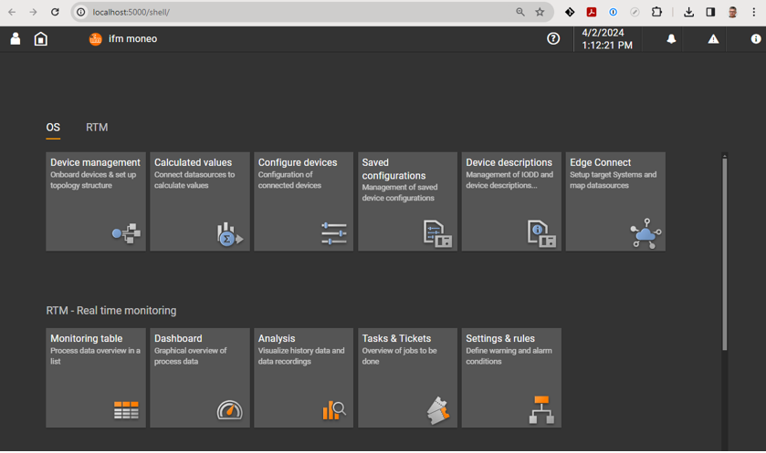
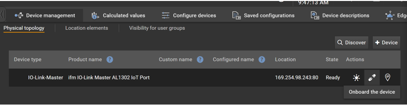
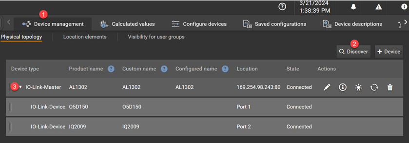
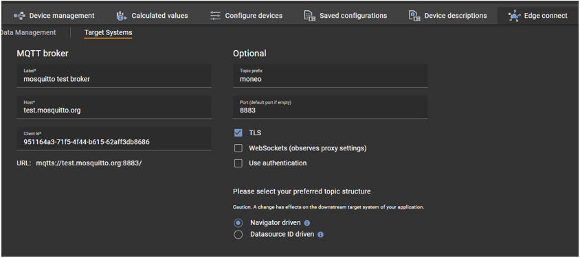

## **Automatik project**

A Blazor App that serves as a telemetry data retrieval tool, interfacing with InfluxDB to retrieve information. The app is equipped with an embedded MQTT client, enabling it to extract telemetry data from IoT devices. Additionally, the app can interface with a distance and inductive sensor (whose data does not get saved in InfluxDB) and save temperature sensor data into InfluxDB.

WebAPI exists for Debugging purposes

## Project Details

| Platform    | GUI    | TimeFrame | Database Solution |
|-------------|--------|-----------|-------------------|
| Webassembly | Blazor | Maj/Juni  | InfluxDB          |

## API endpoints
| API                   | Description                                         | RequestBody        | Response Body               |
|-----------------------|-----------------------------------------------------|--------------------|-----------------------------|
| Get /distance         | Gets latest distance reading                        | null               | Distance object             |
| Get /inductive        | Gets latest inductive reading                       | null               | Inductive object            |
| Get /temperature      | Gets all saved temperatures within given parameters | startdate, enddate | List of temperature objects |
| Get /latestTemperature | Gets Latest temperature                             | null               | Temperature object          |

## Features

 - [x] Automaticly gets all temperature data with in the last 24 hours when site loads
 - [x] Automaticly gets latest temperature reading when one is pushed to MQTT broker
 - [x] Automaticly gets inductive Sensor reading when one is pushed to MQTT broker
 - [x] Automaticly gets Distance sensor reading when one is pushed to MQTT broker
 - [x] Displays temperature in a line chart using radzen graphs
 - [x] Filter all tempetures by date
 - [x] SignalR to autoupdate graphs when new data is send to broker
 - [x] Blazor project showing graphs live updating
 
 **Third party applications used**
 - [InfluxDB](https://influxdata.com)
- [HiveMQ](https://www.hivemq.com/)

## **Nuget packages and libraries used**

**Client**

-   **Blazored.Toast (4.2.1)**: Provides toast notifications for Blazor applications. NuGet | [GitHub](https://github.com/Blazored/Toast)
-   **Microsoft.AspNetCore.SignalR.Client (7.0.19)**: Enables the app to use SignalR for real-time web functionality. [NuGet](https://www.nuget.org/packages/Microsoft.AspNetCore.SignalR.Client/7.0.19) | [Documentation](https://learn.microsoft.com/en-us/aspnet/core/signalr/dotnet-client?view=aspnetcore-7.0)
-   **Microsoft.AspNetCore.SignalR.Common (7.0.19)**: Common libraries required for SignalR functionality. [NuGet](https://www.nuget.org/packages/Microsoft.AspNetCore.SignalR.common/7.0.19)
-   **Radzen.Blazor (4.30.2)**: Offers a set of UI components for building rich, interactive web applications with Blazor. [NuGet](https://www.nuget.org/packages/Radzen.Blazor/4.30.2) | [Documentation](https://blazor.radzen.com/)

**Server**
-   **InfluxDB.Client (4.14.0)**: Client library for interacting with InfluxDB. [NuGet](https://www.nuget.org/packages/InfluxDB.Client/4.14.0) | [GitHub](https://github.com/influxdata/influxdb-client-csharp)
-   **Microsoft.AspNetCore.OpenApi (7.0.18)**: Adds OpenAPI support for ASP.NET Core applications. [NuGet](https://www.nuget.org/packages/Microsoft.AspNetCore.OpenApi/7.0.18) | [Documentation](https://learn.microsoft.com/en-us/aspnet/core/web-api/?view=aspnetcore-7.0#openapi-support)
-   **MQTTnet (4.3.3.952)**: MQTT library for .NET to connect, publish, and subscribe to MQTT brokers. [NuGet](https://www.nuget.org/packages/MQTTnet/4.3.3.952) | [GitHub](https://github.com/dotnet/MQTTnet)
-   **Swashbuckle.AspNetCore (6.5.0)**: Swagger tools for documenting APIs built with ASP.NET Core. NuGet | [GitHub](https://github.com/domaindrivendev/Swashbuckle.AspNetCore)

## Getting Started

Create new accounts at [HiveMQ](https://www.hivemq.com/) and [InfluxDB](https://www.influxdata.com/)

**Add a secrets.json**
in Visual Studio, right click on the "automatikprojekt.server" project, and click on "Manage User Secrets", and add the JSON below, and adjust it acording to your credentials.

     {
      "InfluxDB": {
        "Host": "",
        "INFLUXDB_TOKEN": "",
        "Organization": "",
        "Bucket": ""
      },
    
      "HiveMQ": {
        "ClientID": "",
        "Host": "",
        "Port": ,
        "TopicDistance": "",
        "TopicTemperature": "",
        "TopicInductive": "",
        "Username": "",
        "Password": ""
      }
    }

**Setting up IFM Moneo**
Start here: [https://www.ifm.com/dk/da/shared/moneo-iiot-platform/products/produkter](https://www.ifm.com/dk/da/shared/moneo-iiot-platform/products/produkter)

Download the free Moneo trial version: [https://www.ifm.com/dk/da/shared/moneo-iiot-platform/products/moneo-gratis-proveversion](https://www.ifm.com/dk/da/shared/moneo-iiot-platform/products/moneo-gratis-proveversion)

(we have used the LIC Moneo Starterkit License instead of the Free license.)

Log in with your IFM account. Once Moneo is installed, open a browser at: [http://localhost:5000/shell/](http://localhost:5000/shell/)

## IO-Link Master AL1302 Connection

Connect the network cable between the IoT Port on the IO-Link device and the PC.

In Moneo OS, select `Device management | Physical topology` and click the `Discover` button. It should now be able to find an IO-Link master with a State = Ready.

Click the `Onboard the device` button.

Read the IP address for the IO-Link Master, which is found in the Location column. This address will be used when retrieving data.

You should now see the following:

## MQTT

Ref: Moneo edgeConnect MQTT adapter

Note that the Mosquitto broker now only supports TLS communication via port 8883:

(Shown is setup with a Mosquitto MQTT Broker)